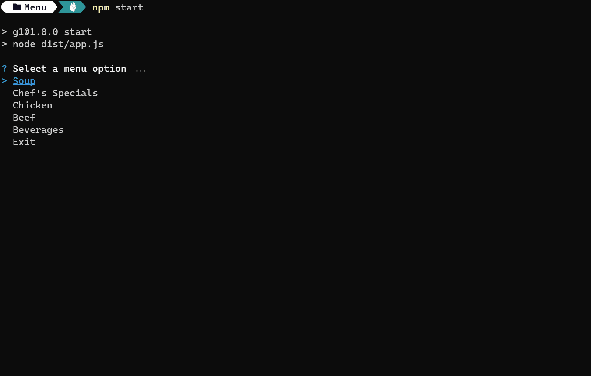

- [Back Homework](../Homework.md)
# Description

You are working at a restaurant, your task is to create the main menu, here are the specifications of the menu. The menu should have the following food:

1. Soup
   - Wonton Soup (Chicken).... $2.25
   - Chicken Corn Soup.... $1.95
   - Vegetable Corn Soup... $2.25
2. Chef's Specials
   - Orange Beef.... $8.95
   - Kung Pao Shrimp.... $8.50
3. Chicken
   - Lemon Chicken.... $9.95
   - Sesame Chicken.... $9.95
   - Hunan Chicken.... $10.50
4. Beef
   - Pepper Steak.... $9.95
   - Manchurian Beef... $11.95
5. Beverages
   - Piña Colada.... $3.00
   - Spanish Coffee.... $5.50

Your Lead tells you that you need to do this by putting in practice the OOP principles that you know, the specifications are this ones:

1. Create a class with the name MenuElement, this class would be the representation of each of the sub options for every main category in the menu, this class needs to have the following:
   - Attributes:
     - id (string)
     - name (string)
     - price (number)
     - emoji (string)
     - Methods
     - printOption
2. When creating an instance of the class, you should pass the name, price, and an emoji related to the option you are selecting (please do not repeat the emojis) .
3. When the instance is being created (in the constructor method) you should assign a unique id for that object. Check the `Unique Id section`.
4. The printOption method should return a string with the following format: `<NAME_OF_THE_OPTION>....$<PRICE_OF_THE_OPTION>`, for example: Spanish Coffee.... $5.50
5. Create a class with the name Menu, this class would be the main class for the menu, it should have the following attributes
   - mainMenu (SelectChoice[]): This attribute is to represent the options in the main menu, the type of this attribute should be of SelectChoice, this type is declared in the Input class
   - soupMenu (Choice[])
   - chefSpecialsMenu (Choice[])
   - chickenMenu (Choice[])
   - beefMenu (Choice[])
   - beveragesMenu (Choice[])
   - soupOptions (MenuElement[])
   - chefSpecialsOptions (MenuElement[])
   - chickenOptions (MenuElement[])
   - beefOptions (MenuElement[])
   - beveragesOptions (MenuElement[])
6. Each of the listed elements with the MenuElement[] type are going to be arrays with instances representing each of the sub-menu elements and each instance inside this array should have the respective information associated with the sub menu option, for example, the beveragesOptions attribute should have instances with the information of the piña colada and spanish coffee options.
7. Each of the listed elements with the Choice[] type are going to be arrays with objects representing each of the options to show in the menu to the user, so for example if the user selects the Beverages option in the menu menu, your program should read the sub options related to this main option and print does options, Piña Colada.... $3.00, Spanish Coffee.... $5.50 for the user to select and option, this Choice type is declared in the Input class.
8. For the method that you need in the Menu class, you need to define the following
   - fillMainMenu
   - fillOptions
   - fillSubMenus
   - showMainMenu
   - showSubMenu
9. This class would have an empty constructor, so no arguments are passed to the creation of an instance of the menu.
10. When creating a menu, you should call the following methods in the following order, calling this methods in that order would prepare the Menu class to show the menu to the user.

- fillMainMenu
- fillOptions
- fillSubMenus

11. `fillMainMenu`: This method would not return anything, this would only fill the main options in the menu, remember that each option should be of type SelectChoice.
12. `fillOptions`: This method would not return anything and would be the method in charge of add the different options for each sub menu, (fill the attributes of type Choice[]) with the correct information, so for example, for the soupOptions attribute, you should add 3 MenuElement instances (Wonton soup, Chicken Corn soup and Vegetable Corn soup).
13. `fillSubMenus`: This method would not return anything and would be the method in charge of creating the options that are going to be printed to the user, because this method would be called after calling the fillOptions menu, you can use each of the attributes of type Choice[] example soupOptions , to fill the menu options, so again, for example the soupMenu attribute should be filled with the choices inside the soupOptions attribute. Remember that each of the elements inside the soupMenu should be of Choice type, so for the name key of the object, you should use the unique id of the MenuElement you are going to add, and the message should be the output of the printOption method of each MenuElement you are adding. So for Example, if you are filling the soupMenu, you need to iterate for each of the soupOptions attribute, yo get the instance and then you get the need it values to fill a soupMenu option (Choice).
14. `showMainMenu`: Here you will show the main menu to the user, this method would be called from the Main class, when called, you should print the menu menu and wait for the user to select, after selecting, you should check for the option the user selected, and show the sub-menu related to that option. So for example, you show the main menu and the user selects Soup, you should then show the Soup Sub menu for the user to select an option of that sub-menu. Take in mind that here you should also show an Exit option, for the user to terminate your program.
15. `showSubMenuOption`: This method would be called from showMainMenu on each of the options, except when the user decides to exit your program. This method should receive the following arguments

- message (string) : Message to show in the sub menu
- subMenu (Choice[]): The elements to show in the sub menu
- subMenuOptions (MenuElement[]): The options that are related to the sub menu

16. The `showSubMenuOption` should be in charge to show the selected sub-menu from showMainMenu option selected, and then if the user selects and option from that sub-menu, your program need to show the following message : `“Here is your <EMOJI_OF_THE_SELECTED_OPTION> at a $<PRICE_OF_THE_SELECTED_OPTION> cost”`, the idea is to show the subMenu options and then find the selected option inside the subMenuOptions elements and show the emoji and price information to the user.
17. Remember that after the user has selected an option of the sub-menu, the user gets the message with the information of the selected option (emoji and price) and then the main menu is shown again to the user, to select the next option or to exit the program.
18. The Main class should only need to have the creation of an instance of the class menu and the call for the showMainMenu option.

## Tip

Use the `Input` class to create the menu and sub-menus

## Unique Id

To create a unique id, you can use an exernal package, [uuid](https://www.npmjs.com/package/uuid) along with [@types/uuid](https://www.npmjs.com/package/@types/uuid) package to get this package working with types, for that here is an example on how to use the package:

```
  $ npm install uuid
  $ npm install --save @types/uuid
```

```typescript
import { v4 as uuidv4 } from 'uuid';
let uniqueId = uuidv4(); // this would return a unique id
```

## Start Code

### app.ts

```typescript
import { Main } from './Main';
const program = new Main();
program.start();
```

### Main.ts

```typescript
import { Menu } from './Menu';
export class Main {
  async start() {
    const menu = new Menu();
    await menu.showMainMenu();
  }
}
```

# Demostration



### Files
- [MenuElement.ts](./E01/MenuElement.ts)
- [Menu.ts](./E01/Menu.ts)
- [Input.ts](./E01/Input.ts)
- [Main.ts](./E01/Main.ts)

```javascript
import { Main } from './WEEK-6/E01/Main';
const program = new Main();
program.start();
```
