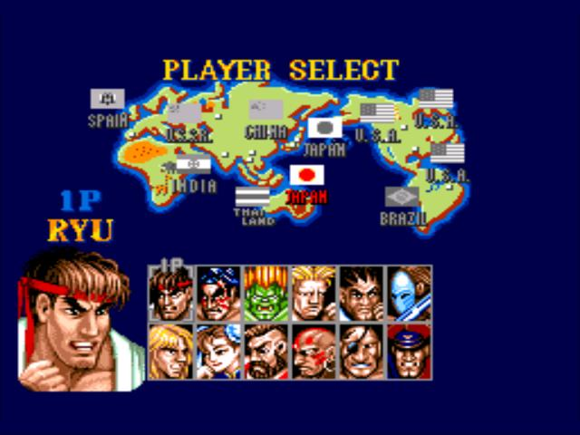

# Build Tower
Build Tower
Build Tower by the following given argument:
number of floors (integer and always greater than 0).

Tower block is represented as *

Python: return a list;
JavaScript: returns an Array;
C#: returns a string[];
PHP: returns an array;
C++: returns a vector<string>;
Haskell: returns a [String];
Ruby: returns an Array;
Lua: returns a Table;
Have fun!

for example, a tower of 3 floors looks like below
```
[
  '  *  ', 
  ' *** ', 
  '*****'
]
```
and a tower of 6 floors looks like below
```
[
  '     *     ', 
  '    ***    ', 
  '   *****   ', 
  '  *******  ', 
  ' ********* ', 
  '***********'
]
```
Go challenge Build Tower Advanced once you have finished this :)

## Solution

```typescript
export const towerBuilder = (nFloors: number): string[] => {
    let heightTower = ( nFloors * 2 ) - 1;
    let floors:string[] = [];
    let i = 1;
    while(i <= nFloors){
        let asterisks = (i * 2) - 1;
        let spaces = ( heightTower - asterisks )  / 2;
        floors.push(`${' '.repeat(spaces)}${'*'.repeat(asterisks)}${' '.repeat(spaces)}`);
        i++;
    }
    return floors;
}
```
# Highest Scoring Word
Given a string of words, you need to find the highest scoring word.

Each letter of a word scores points according to its position in the alphabet: `a = 1, b = 2, c = 3` etc.

You need to return the highest scoring word as a string.

If two words score the same, return the word that appears earliest in the original string.

All letters will be lowercase and all inputs will be valid.
## Solution

```typescript
export const high = (str: string): string => {
    let letters = ["a","b","c","d","e","f","g","h","i","j","k","l","m","n","o","p","q","r","s","t","v","w","x","y","z"]
    let max = {letter:"", size:0, position: -1}
    str.split(" ").forEach((letter,index) => {
        let size = letter.split("").reduce((t,n) => t + (letters.indexOf(n) + 1),0 );
        if (max.size < size ) {max.letter = letter; max.size = size, max.position = index} 
        else if (max.size === size && max.position > index){max.letter = letter; max.size = size, max.position = index} 
    });  
    return max.letter;
}
```
# Equal Sides Of An Array
You are going to be given an array of integers. Your job is to take that array and find an index N where the sum of the integers to the left of N is equal to the sum of the integers to the right of N. If there is no index that would make this happen, return -1.

For example:

Let's say you are given the array {1,2,3,4,3,2,1}:
Your function will return the index 3, because at the 3rd position of the array, the sum of left side of the index ({1,2,3}) and the sum of the right side of the index ({3,2,1}) both equal 6.

Let's look at another one.
You are given the array {1,100,50,-51,1,1}:
Your function will return the index 1, because at the 1st position of the array, the sum of left side of the index ({1}) and the sum of the right side of the index ({50,-51,1,1}) both equal 1.

Last one:
You are given the array {20,10,-80,10,10,15,35}
At index 0 the left side is {}
The right side is {10,-80,10,10,15,35}
They both are equal to 0 when added. (Empty arrays are equal to 0 in this problem)
Index 0 is the place where the left side and right side are equal.

Note: Please remember that in most programming/scripting languages the index of an array starts at 0.

Input:
An integer array of length 0 < arr < 1000. The numbers in the array can be any integer positive or negative.

Output:
The lowest index N where the side to the left of N is equal to the side to the right of N. If you do not find an index that fits these rules, then you will return -1.

Note:
If you are given an array with multiple answers, return the lowest correct index.

## Solution
```typescript
export function findEvenIndex(arr: number[]): number {
    var sum = 0,
      leftSum = 0;
  
    for (var i = 0; i < arr.length; i++) {
      sum += arr[i];
    }
  
    for (var i = 0; i < arr.length; i++) {
      sum -= arr[i];
      if (leftSum === sum) {
        return i;
      }
      leftSum += arr[i];
    }
  
    return -1;
}
```

# Meeting
John has invited some friends. His list is:

s = "Fred:Corwill;Wilfred:Corwill;Barney:Tornbull;Betty:Tornbull;Bjon:Tornbull;Raphael:Corwill;Alfred:Corwill";
Could you make a program that

makes this string uppercase
gives it sorted in alphabetical order by last name.
When the last names are the same, sort them by first name. Last name and first name of a guest come in the result between parentheses separated by a comma.

So the result of function meeting(s) will be:

`"(CORWILL, ALFRED)(CORWILL, FRED)(CORWILL, RAPHAEL)(CORWILL, WILFRED)(TORNBULL, BARNEY)(TORNBULL, BETTY)(TORNBULL, BJON)"`
It can happen that in two distinct families with the same family name two people have the same first name too.

Notes
You can see another examples in the "Sample tests".
## Solution
```typescript
export function meeting(s: string): string {
    return s.toUpperCase().split(";").sort((a:string, b:string) => {
        let fulleameA = a.split(":");
        let fullNameB = b.split(":");
        let expresion = fulleameA[1].localeCompare(fullNameB[1]);

        if( expresion == 0) return fulleameA[0].localeCompare(fullNameB[0]);
        return expresion;
    }).map(e => `(${e.split(":")[1]}, ${e.split(":")[0]})`).join("");
}
```

# Street Fighter 2 - Character Selection
Short Intro

Some of you might remember spending afternoons playing Street Fighter 2 in some Arcade back in the 90s or emulating it nowadays with the numerous emulators for retro consoles.

Can you solve this kata? Suuure-You-Can!

UPDATE: a new kata's harder version is available here.

The Kata

You'll have to simulate the video game's character selection screen behaviour, more specifically the selection grid. Such screen looks like this:

Screen:


  
## Solution
  
```typescript
export function streetFighterSelection(fighters: Array<string[]>, position: number[], moves: string[]) {
   let [x , y] = position;
    return moves.map(m => {
        if(m === 'up') x = (x - 1) >= 0 ? (x - 1) : x;
        else if(m === 'down') x = (x + 1) <= 1 ? (x + 1) : x;
        else if(m === 'left') y = (y - 1) >= 0 ? (y - 1) : 5;
        else if(m === 'right') y = (y + 1) <= 5  ? (y + 1) : 0;
        return fighters[x][y];
    })
}
```
